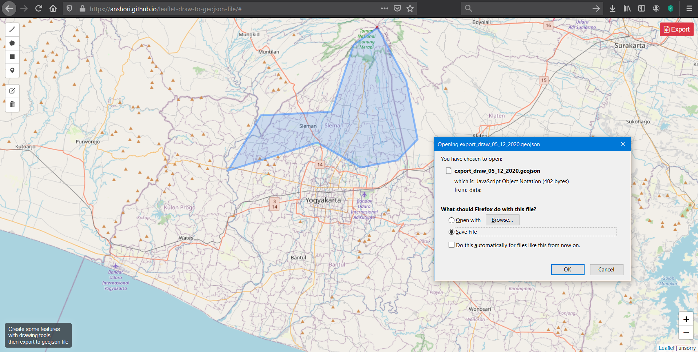

# Leaflet Draw to GeoJSON File

Draw some features then export them as geojson files.
The polygon feature will automatically have the area (hectares) and the line feature will automatically have the distance (meters) in the attribute.

> Demo: [https://anshori.github.io/leaflet-draw-to-geojson-file/](https://anshori.github.io/leaflet-draw-to-geojson-file/)

##

`unsorry@2020`
